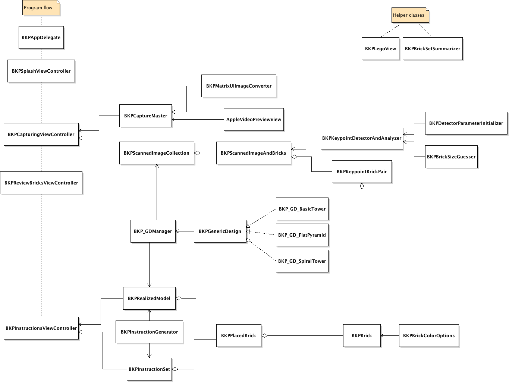

# Brickspace

## with Structure Sensor support

The version on this branch includes support for the [Structure Sensor](http://structure.io) from Occipital.

- The sensor is optional. With the sensor plugged in, the app will attempt to detect the size of bricks and assign one of the four supported sizes (2x1, 2x2, 2x3, 2x4).
- The app bundle has been renamed to `com.ansonjablinski.BrickspaceStructure` to distinguish it from the App Store version (`com.ansonjablinski.Brickspace`).
- The [Structure SDK](http://structure.io) and [OpenCV](http://opencv.org) frameworks for iOS (not included) are required to build the app.

## Overview

An iPad application that counts your Lego bricks and tells you what to build.

By [Anson Jablinski](http://ansonj.org). Created for the [University of Houston](http://uh.edu)'s 2014 Summer Undergraduate Research Fellowship project, and developed under the supervision of Ioannis Kakadiaris and the [UH Computational Biomedicine Laboratory](http://cbl.uh.edu/).

Detailed information about the app is available at [the project website](http://ansonj.org/brickspace).

## Class diagram

